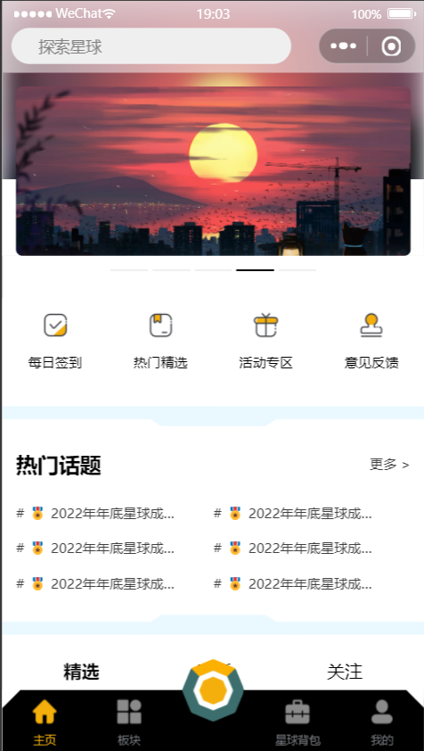
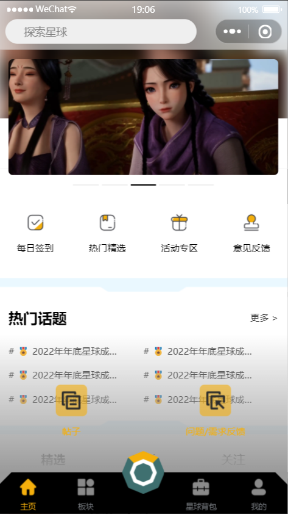
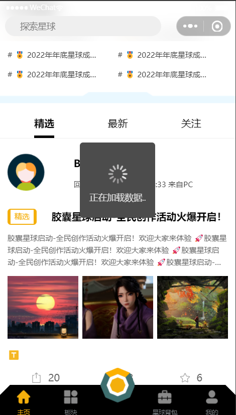
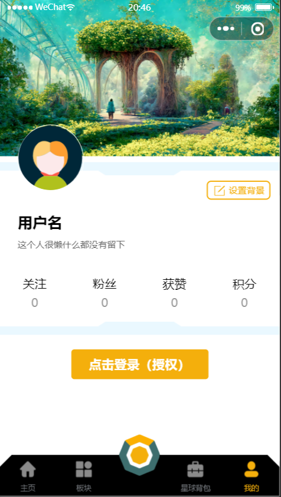
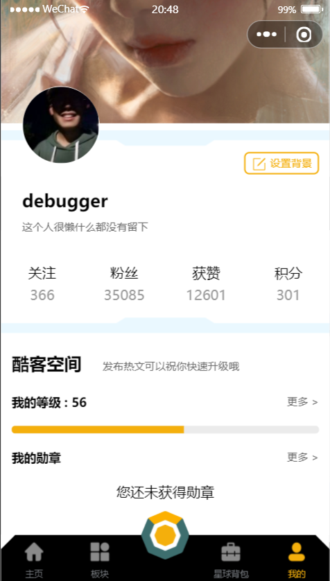
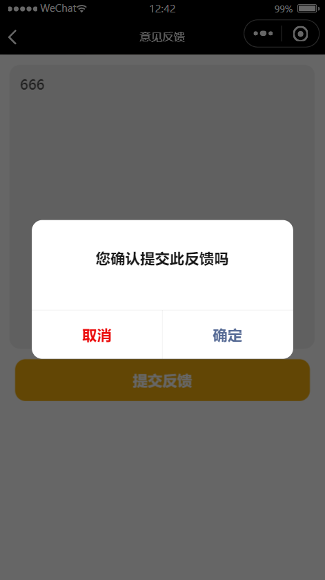
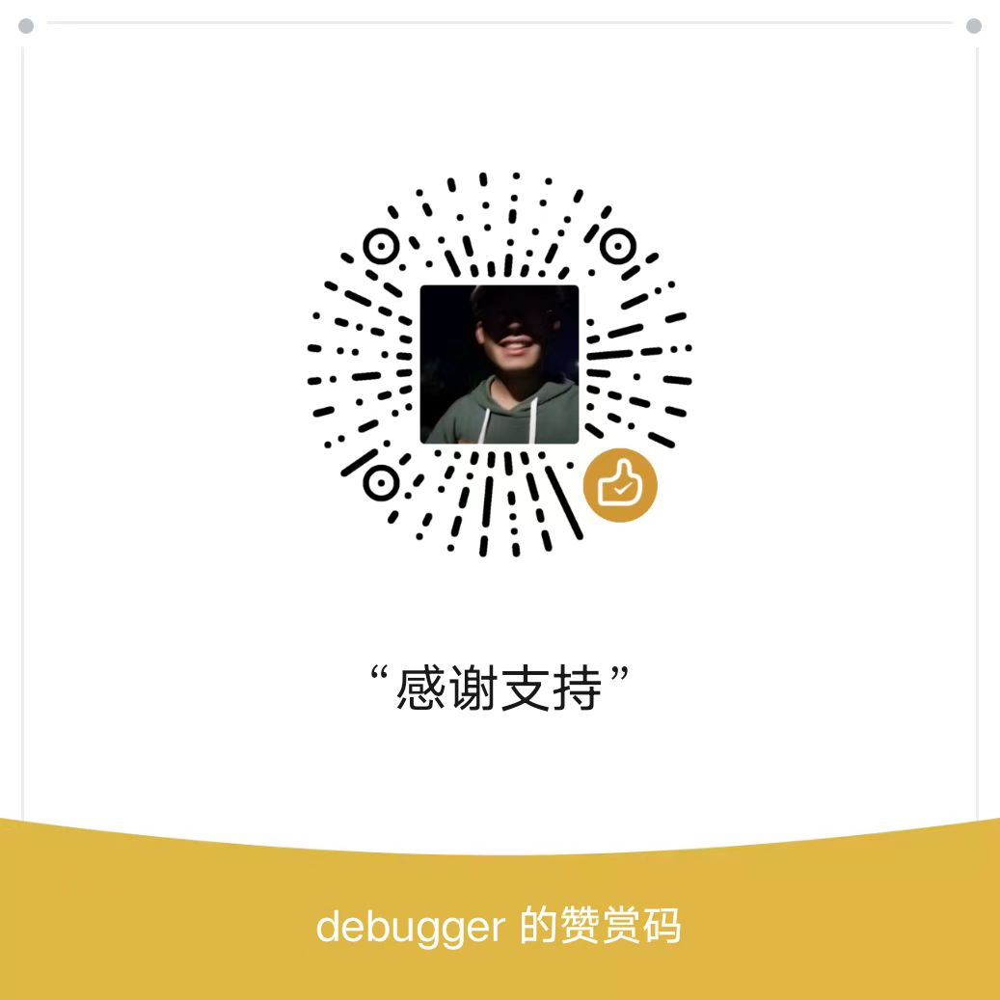

# 《胶囊星球》微信小程序项目 🦄

<<<<<<< HEAD
[](https://img.shields.io/badge/%20%F0%9F%A6%84%20%20WeChat--mini--program%20%20-%20%20develop%20%20-orange)
=======

>>>>>>> 05f0d04c7aeb40eecc5159471e71908f1d5bd071

## 项目背景

一个乐于分享行业知识的平台，如果觉得不错的话，可以点一个 Star 支持一下作者，之后会不断进行完善推出更多的产品项目

关于微信小程序的学习可以参考我的[ 个人博客( CSDN ) ](https://blog.csdn.net/weixin_63836026/article/details/127456823)以及微信小程序官方文档

## 项目依赖

- node
- npm
- Weui 组件库（[怎样安装 Weui](https://wechat-miniprogram.github.io/weui/docs/quickstart.html#%E4%BD%BF%E7%94%A8%E4%B9%8B%E5%89%8D)）

## 开发环境

- 微信小程序 2.19.4 版本

## 技术简介

1. 微信小程序

- 自定义组件【自定义 TabBar、自定义 NavBar...】
- 全局状态的注册与挂载
- 表单的基本使用
- 小程序开发常用 API
- 路由跳转
- 方法封装
- 数据请求
- 条件判断条件循环-视图层与逻辑层的交互

1. 本地数据持久化
2. 前端分页方案
3. 代码、性能优化
4. Weui 库
5. 前端工程化模块化封装理念
6. 项目整体采用 Grid + 流式布局实现多种排版效果（瀑布流、网格布局...）

## 项目鸣谢

- 后端数据模拟鸣谢：[Easy Mock](https://mock.mengxuegu.com/)
- icon 图标：[iconfont](https://www.iconfont.cn/)
- 部分图片来源鸣谢： [unsplash](https://unsplash.dogedoge.com/)、[wallhaven](https://wallhaven.cc/)
- UI 灵感来源：IQQO 小程序、即时设计、Dribbble... 在此鸣谢

---

# 项目架构以及依赖搭建

### 单元描述

项目页面以及依赖搭建，该项目包含 10 个页面（四个 TabBar 页面），3 个自定义组件

### 单元实施

- 在 `page` 文件夹之下创建四个 TabBar 页面：index(主页)、my(我的)、shop(背包)、plate(板块)

- 引入 Weui 组件库

```shell
npm i weui-miniprogram
```

构建完成 npm 之后在需要使用组件的页面引入 `wxss` 即可使用其组件

```shell
@import 'weui-miniprogram/weui-wxss/dist/style/weui.wxss';
```

---

# 部分项目页面功能展示

</img>
</img>
</img>
</img>
</img>
</img>
</img>
</img>
</img>

---

# 最后 🎉

**详细项目开发文档请查看该仓库的 `document` 文件夹**

如果你觉得该项目还不错的话，可以考虑请我我一杯咖啡 ☕ 😁


