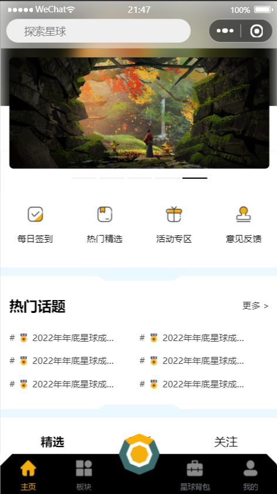
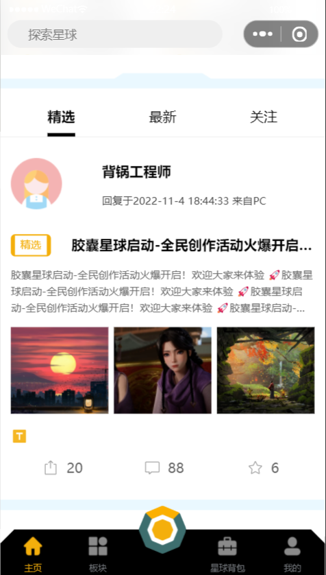
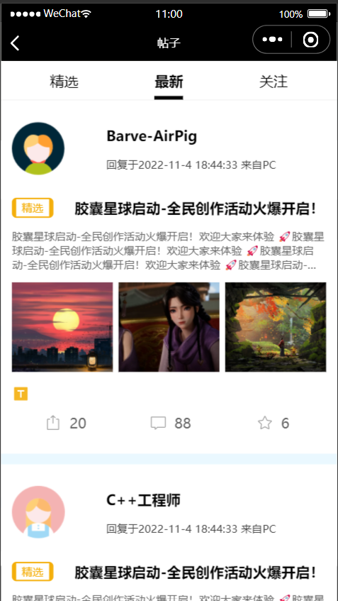
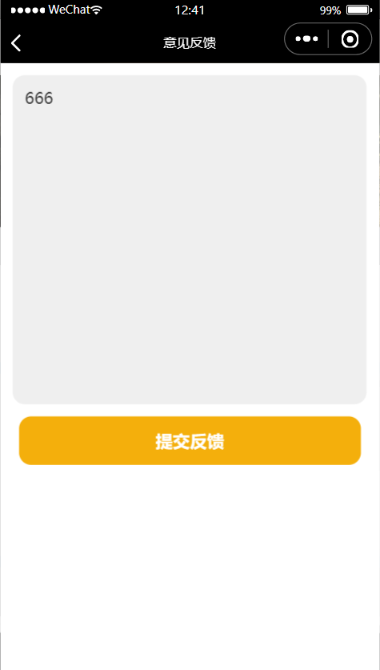
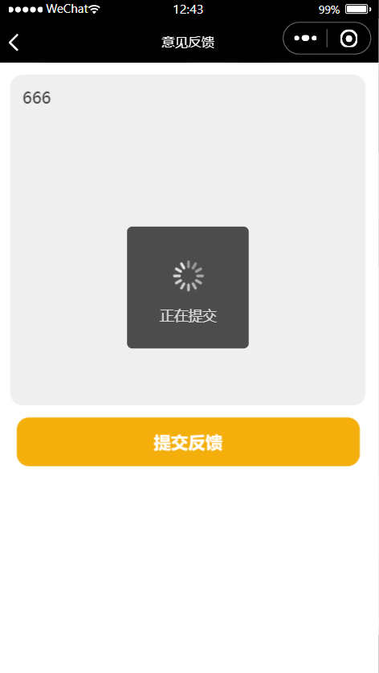
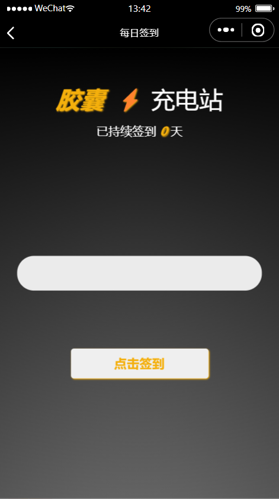
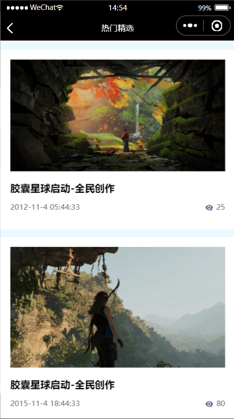
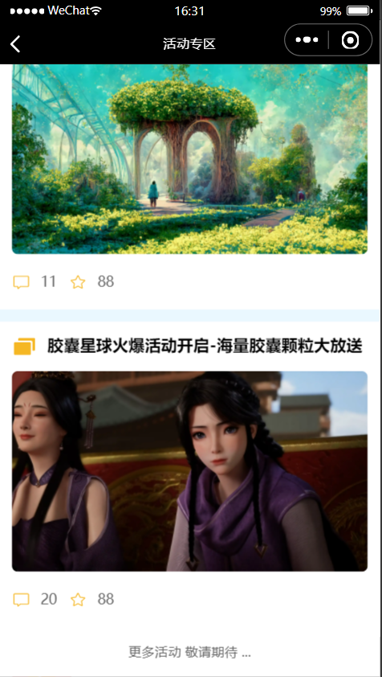
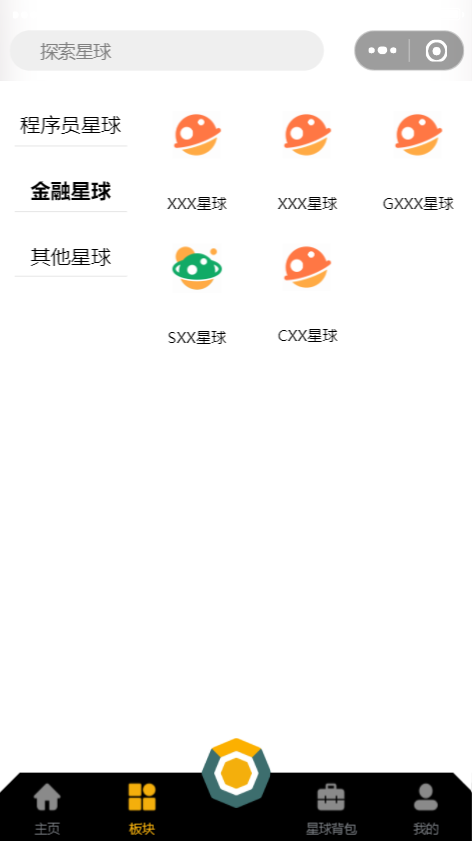
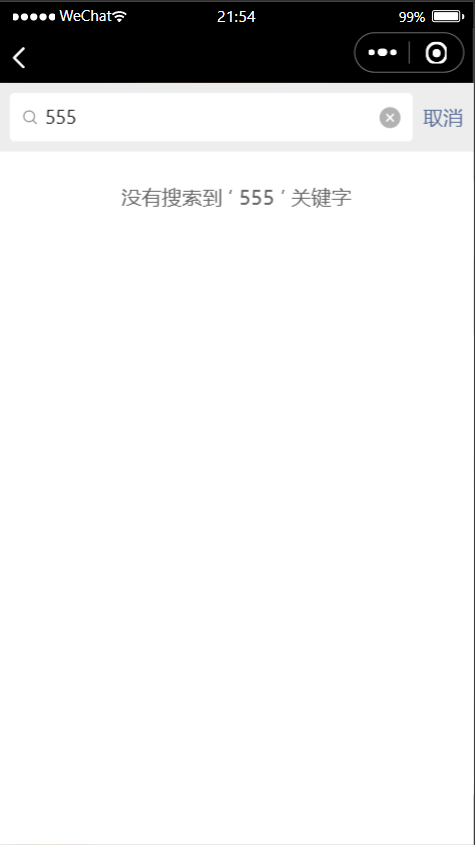

# 《胶囊星球》微信小程序项目开发文档 📑

## 项目背景

一个乐于分享行业知识的平台，如果觉得不错的话，可以点一个 Star 支持一下，之后会不断进行完善推出更多的产品项目

关于微信小程序的学习可以参考我的[ 个人博客( CSDN ) ](https://blog.csdn.net/weixin_63836026/article/details/127456823)以及官方文档

## 项目依赖

- node
- npm
- Weui 组件库（[怎样安装 Weui](https://wechat-miniprogram.github.io/weui/docs/quickstart.html#%E4%BD%BF%E7%94%A8%E4%B9%8B%E5%89%8D)）

## 开发环境

- 微信小程序 2.19.4 版本

## 技术简介

1. 微信小程序

- 自定义组件【自定义 TabBar、自定义 NavBar...】
- 全局状态的注册与挂载
- 表单的基本使用
- 小程序开发常用 API
- 路由跳转
- 方法封装
- 数据请求
- 条件判断条件循环-视图层与逻辑层的交互

1. 本地数据持久化
2. 前端分页方案
3. 代码、性能优化
4. Weui 库
5. 前端工程化模块化封装理念
6. 项目整体采用 Grid + 流式布局实现多种排版效果（瀑布流、网格布局...）

## 项目鸣谢

- 后端数据模拟鸣谢：[Easy Mock](https://mock.mengxuegu.com/)
- icon 图标：[iconfont](https://www.iconfont.cn/)
- 部分图片来源鸣谢： [unsplash](https://unsplash.dogedoge.com/)、[wallhaven](https://wallhaven.cc/)
- UI 灵感来源：IQQO 小程序、即时设计、Dribbble... 在此鸣谢

---

# 项目架构以及依赖搭建

### 单元描述

项目页面以及依赖搭建，该项目包含 10 个页面（四个 TabBar 页面），3 个自定义组件

### 单元实施

- 在 `page` 文件夹之下创建四个 TabBar 页面：index(主页)、my(我的)、shop(背包)、plate(板块)

- 引入 Weui 组件库

```shell
npm i weui-miniprogram
```

构建完成 npm 之后在需要使用组件的页面引入 `wxss` 即可使用其组件

```shell
@import 'weui-miniprogram/weui-wxss/dist/style/weui.wxss';
```

---

# 自定义 TabBar

</img>
</img>

### 单元描述

自定义 TabBar，简单条件判断实现视图层与逻辑层的交互

### 单元实施

`app.json`中的 TabBar 配置不需要删除, 否则会报错, 全局配置 `"custom": true` 自定义配置 TabBar

```json
{
	"pages": [
		"pages/index/index",
		"pages/my/my",
		"pages/plate/plate",
		"pages/shop/shop"
	],
	"window": {
		"backgroundTextStyle": "light",
		"navigationStyle": "custom"
	},
	"entryPagePath": "pages/index/index",
	"style": "v2",
	"sitemapLocation": "sitemap.json",
	"tabBar": {
		"custom": true,
		"list": [
			{
				"pagePath": "pages/index/index",
				"iconPath": "/images/home_no.png",
				"selectedIconPath": "/images/home.png",
				"text": "主页"
			},
			{
				"pagePath": "pages/plate/plate",
				"iconPath": "/images/plate_no.png",
				"selectedIconPath": "/images/plate.png",
				"text": "板块"
			},
			{
				"pagePath": "pages/shop/shop",
				"iconPath": "/images/shop_no.png",
				"selectedIconPath": "/images/shop.png",
				"text": "星球背包"
			},
			{
				"pagePath": "pages/my/my",
				"iconPath": "/images/my_no.png",
				"selectedIconPath": "/images/my.png",
				"text": "我的"
			}
		]
	}
}
```

在项目根目录新建 `custom-tab-bar` 文件夹存放自定义导航组件，在 `index.js`中进行配置

```javascript
Component({
	data: {
		btn_show: false,
		selected: 0,
		color: "#7A7E83",
		selectedColor: "#f4af0c",
		list: [
			{
				pagePath: "/pages/index/index",
				iconPath: "/images/home_no.png",
				selectedIconPath: "/images/home.png",
				text: "主页",
			},
			{
				pagePath: "/pages/plate/plate",
				iconPath: "/images/plate_no.png",
				selectedIconPath: "/images/plate.png",
				text: "板块",
			},
			{
				pagePath: "/pages/shop/shop",
				iconPath: "/images/shop_no.png",
				selectedIconPath: "/images/shop.png",
				text: "星球背包",
			},
			{
				pagePath: "/pages/my/my",
				iconPath: "/images/my_no.png",
				selectedIconPath: "/images/my.png",
				text: "我的",
			},
		],
	},
	attached() {},
	methods: {
		switchTab(e) {
			const data = e.currentTarget.dataset
			const url = data.path
			wx.switchTab({ url })
		},
		btnSwitch() {
			this.setData({
				btn_show: !this.data.btn_show,
			})
		},
	},
})
```

`index.json`配置开启组件

```json
{
	"component": true
}
```

`index.wxml` 配置

微信小程序给我们提供了自定义 TabBar 的案例，我没有使用提供好的配置是因为用不惯 `cover` 相关组件，这些 `cover` 组件大幅度降低了样式的可用性，最高层叠性有时也是一个不怎么好的选择

**整个 TabBar 将围绕着 btn_show 状态进行功能实施**

- btn_show 将控制中间按钮的样式切换
- btn_show 将控制多功能的 show 以及 hide
- btn_show 将控制三角形的颜色（因为弹出功能会有过渡阴影样式，增加颜色变换功能将使项目更加真实）

```html
<!-- 中间多选项按钮 -->
<cover-view class="btn_img_box">
	<cover-image
		class="btn_img"
		src="{{ btn_show ? '../images/KMD_no.png' : '../images/KMD.png' }}"
	></cover-image>
</cover-view>

<view class="tab-bar">
	<!-- 循环TabBar列表项 -->
	<view
		wx:for="{{list}}"
		wx:key="index"
		class="tab-bar-item"
		data-path="{{item.pagePath}}"
		data-index="{{index}}"
		bindtap="switchTab"
	>
		<image
			src="{{selected === index ? item.selectedIconPath : item.iconPath}}"
			mode="heightFix"
		></image>
		<view style="color: {{selected === index ? selectedColor : color}}"
			>{{item.text}}</view
		>
	</view>

	<!-- 三角设计 -->
	<view
		class="'tab-bar-border_left' + {{  btn_show ? 'tab-bar-border_left_show' : ''  }}"
	></view>
	<view
		class="'tab-bar-border_right' + {{  btn_show ? 'tab-bar-border_right_show' : ''  }}"
	></view>
</view>

<!-- 跳出功能选项 -->
<view class="show_state" wx:if="{{ btn_show }}">
	<view class="left_state">
		<image src="../images/text.png" mode="heightFix"></image>
		<text>帖子</text>
	</view>

	<view class="right_state">
		<image src="../images/feedback.png" mode="heightFix"></image>
		<text>问题/需求反馈</text>
	</view>
</view>
```

`index.wxss` 编写

对于中间空位的位置使用一个边距来顶占位，中间按钮使用 `cover` 组件在这里是比较合适的

再者就是动态类与逻辑层进行一个简单交互

```css
/* 中间按钮 */
.btn_img_box {
	position: fixed;
	bottom: 27.5px;
	left: 50%;
	transform: translate(-50%, 0);
	height: 55px;
	width: 55px;
}

/* tabbar */
.tab-bar {
	width: 100vw;
	position: fixed;
	bottom: 0;
	left: 0;
	right: 0;
	height: 55px;
	background: #000;
	display: flex;
	padding-bottom: env(safe-area-inset-bottom);
}

.tab-bar-item {
	flex: 1;
	text-align: center;
	display: flex;
	justify-content: center;
	align-items: center;
	flex-direction: column;
}

.tab-bar :nth-of-type(3) {
	margin-left: 150rpx;
}

.tab-bar-item image {
	height: 100%;
	margin: 10rpx 0;
}

.tab-bar-item view {
	font-size: 10px;
	margin-bottom: 10rpx;
}

.tab-bar-border_left,
.tab-bar-border_right {
	position: absolute;
	top: 0;
	height: 0;
	width: 0;
	border-top: 8px solid transparent;
	border-left: 8px solid transparent;
	border-bottom: 8px solid #fff;
	border-right: 8px solid #fff;
}

.tab-bar-border_left {
	left: 0;
	transform: rotate(180deg);
}

.tab-bar-border_right {
	right: 0;
	transform: rotate(270deg);
}

/* 动态类 */

.tab-bar-border_left_show,
.tab-bar-border_right_show {
	border-bottom: 8px solid #999;
	border-right: 8px solid #999;
}

.btn_img_box .btn_img {
	height: 100%;
	width: 100%;
}

/* 多功能 */
.show_state {
	color: #fff;
	display: grid;
	grid-template-columns: repeat(2, 1fr);
	position: fixed;
	bottom: 54px;
	left: 0;
	height: 180px;
	width: 100vw;
	text-align: center;
	z-index: -99;
	background-image: linear-gradient(to top, #999, transparent);
}

.show_state view {
	display: grid;
	grid-template-rows: repeat(2, 1fr);
	justify-items: center;
	align-items: center;
	background-color: transparent;
	font-size: 24rpx;
	color: #f4af0c;
	margin-top: 54px;
}

.show_state view text {
	align-self: flex-start;
}

.show_state image {
	width: 45%;
	height: 45%;
	background-color: rgba(244, 174, 11, 0.6);
	padding: 12rpx;
	border-radius: 12rpx;
}
```

最后我们需要对每一个 TabBar 页面都进行一个匹配 （只配置一个作为示例）

```javascript
  onShow() {
    // 如果有这个方法并且调用 getTabbar 这个实例
    if(typeof this.getTabBar == 'function' && this.getTabBar()) {
       this.getTabBar().setData({
       // 第一页,后面页面ID依次递增
        selected: 0
       })
     }
   },
 onHide() {
  // 离开页面我们清除一下底部弹出的多功能选项
  if(typeof this.getTabBar == 'function' && this.getTabBar()) {
    this.getTabBar().setData({
        btn_show: false
    })
  }
 }
```

---

# 自定义 NavBar / Search 组件

</img>

### 单元描述

自定义顶部 NavBar，全局挂载状态

### 单元实施

配置其他自定义组件不需要在根目录配置，至于自定义 TabBar 为什么在根目录配置...好像这已经是一种约定俗成的规矩，我们新创建一个 components 文件夹，之后可复用组件就都放在 component 文件夹之下就好了

`navbar.wxml` 编写

我打算在之后单独写一个搜索页面，也就是说这个 input 是一个路由跳转，有没有必要写这个 input 无所谓了

```html
<!-- 自定义顶部栏 -->
<view class="nav-bar" style="height:{{ navBarHeight }}px;">
    <input class="navColor search" placeholder="探索星球" style="height:{{ menuHeight }}px; min-height:{{ menuHeight }}px;line-height:{{ menuHeight }}px; left:{{ menuRight }}px; top:{{ menuTop }}px;"></input>
</view>

<!-- 占位，高度与顶部栏一样 -->
<view style="height:{{ navBarHeight }}px;"></view>

```

将行内样式都写成状态数据是为了适配不断变化的微信小程序右上角的胶囊按钮，还好我们可以通过 API 来获取，这个应该会多次使用在不同页面中，所以还是写到全局中比较好

`app.js` 编写

```javascript
App({
	onLaunch(options) {
		// 获取系统信息
		const systemInfo = wx.getSystemInfoSync()
		// 胶囊按钮位置信息
		const menuButtonInfo = wx.getMenuButtonBoundingClientRect()
		// 导航栏高度 = 状态栏高度 + 44
		this.globalData.navBarHeight = systemInfo.statusBarHeight + 44
		this.globalData.menuRight = systemInfo.screenWidth - menuButtonInfo.right
		this.globalData.menuTop = menuButtonInfo.top
		this.globalData.menuHeight = menuButtonInfo.height
	},
	// 数据都是根据当前机型进行计算，这样的方式兼容大部分机器
	globalData: {
		navBarHeight: 0, // 导航栏高度
		menuRight: 0, // 胶囊距右方间距（方保持左、右间距一致）
		menuTop: 0, // 胶囊距底部间距（保持底部间距一致）
		menuHeight: 0, // 胶囊高度（自定义内容可与胶囊高度保证一致）
	},
})
```

`navbar.js` 编写

```javascript
const app = getApp()
Component({
	data: {
		navBarHeight: app.globalData.navBarHeight,
		menuRight: app.globalData.menuRight,
		menuTop: app.globalData.menuTop,
		menuHeight: app.globalData.menuHeight,
	},
})
```

`navbar.wxss` 编写

这里我们给背景一个高斯模糊，突出视觉体验

```css
.nav-bar {
	position: fixed;
	width: 100%;
	top: 0;
	color: #fff;
	background-color: rgb(255, 255, 255, 0.5);
	backdrop-filter: blur(15px);
	z-index: 99;
}

.navColor {
	background-color: #fff;
}

.nav-bar .search {
	width: 60%;
	color: #333;
	font-size: 14px;
	background: #fff;
	position: absolute;
	border-radius: 24px;
	background: #efefef;
	padding-left: 24px;
}
```

---

# 程序主页开发

</img>

### 单元描述

主页开发（轮播图、功能选项、热门话题）

移动端样式，后端数据模拟，使用 wx 的 requst API 进行数据网络请求

### 单元实施

基础项目开发，没有像之前我们自定义组件那样有趣，不过我们需要注意一点：微信小程序或者说整体移动端开发的样式都是比较特殊的（eg：如果给到一个元素宽度，margin 或者 padding 就会发生偏移），再者就是一个数据的请求与解析也是有些趣味的

`index.wxml` 编写

轮播图的高斯模糊图片我使了一个小聪明，轮播图的名字是以数字结尾的，通过轮播图 API 监听到图片 ID 正好可以对上，倒也省事 `src="../../images/swiper/{{ imgNum }}.jpg"`

自定义轮播图指针借助一个状态进行比对比匹配动态样式

```html
<navigation-bar></navigation-bar>
<view>
	<!-- 背景高斯模糊效果 -->
	<view class="index_bg_box">
		<image
			class="bg_img"
			src="../../images/swiper/{{ imgNum }}.jpg"
			mode="widthFix"
		></image>
		<view class="style_box"></view>
	</view>

	<!-- 轮播图 -->
	<swiper
		autoplay="true"
		interval="5000"
		duration="500"
		indicator-color="#999"
		indicator-active-color="#fff"
		circular="true"
		bindchange="swiperFunc"
	>
		<block wx:for="{{ swiperList }}" wx:key="item.id">
			<swiper-item>
				<view class="swiper-item">
					<image src="{{ item.url }}" mode="aspectFill"></image>
				</view>
			</swiper-item>
		</block>
	</swiper>

	<!-- 自定义轮播图指针 -->
	<view class="strip_box">
		<view
			class="{{ imgNum == item.id ? 'strip strip_av' : 'strip' }}"
			wx:for="{{ swiperList }}"
			wx:key="item.id"
		></view>
	</view>

	<!-- 剩余所有功能盒子 -->
	<view class="container">
		<!-- 选项卡 -->
		<view class="control">
			<view class="control_little">
				<view class="img_box">
					<image src="../../images/sign.png" mode="widthFix"></image>
				</view>
				<text>每日签到</text>
			</view>
			<view class="control_little">
				<view class="img_box">
					<image src="../../images/hot.png" mode="widthFix"></image>
				</view>
				<text>热门精选</text>
			</view>
			<view class="control_little">
				<view class="img_box">
					<image src="../../images/active.png" mode="widthFix"></image>
				</view>
				<text>活动专区</text>
			</view>
			<view class="control_little">
				<view class="img_box">
					<image src="../../images/feed.png" mode="widthFix"></image>
				</view>
				<text>意见反馈</text>
			</view>
		</view>

		<image class="hr" src="../../images/hr3.png" mode="widthFix"></image>

		<!-- 热门话题 -->
		<view class="hot_say">
			<view class="title">
				<text class="title_text">热门话题</text>
				<text class="title_more">更多 ></text>
			</view>

			<view class="hot_list">
				<view class="list_box" wx:for="{{ hotNewsList }}" wx:key="item.id">
					<text># 🎖️ {{ item.newsTitle }}</text>
				</view>
			</view>
		</view>

		<image class="hr_rev" src="../../images/hr3.png" mode="widthFix"></image>

		<!-- 切换列表 -->
		<view class="select_list">
			<select-list></select-list>
		</view>
	</view>
</view>
```

无论是 `wxml` 中提到的 `<navigation-bar></navigation-bar>` 还是 `<select-list></select-list>` 都是自定义组件，不要忘记在对应页面 JSON 文件中进行配置：

```json
{
	"usingComponents": {
		"mp-searchbar": "weui-miniprogram/searchbar/searchbar",
		"navigation-bar": "/components/navbar/navbar",
		"select-list": "/components/list/list"
	}
}
```

`index.wxss` 编写

```css
/* 导入weui样式 */
@import "../../miniprogram_npm/weui-miniprogram/weui-wxss/dist/style/weui.wxss";

.index_bg_box {
	position: fixed;
	top: 0;
	left: 0;
	width: 100%;
	overflow: hidden;
	z-index: -9;
}

.index_bg_box .bg_img {
	width: 100%;
	filter: blur(10px);
}

.index_bg_box .style_box {
	position: absolute;
	top: 70%;
	left: -50%;
	width: 300vw;
	height: 150vw;
	background-color: #ffffff;
}

/* 轮播图 */
swiper {
	margin: 24rpx 0;
	overflow: hidden;
}

.swiper-item {
	height: 100%;
	margin: 0 24rpx;
}

.swiper-item image {
	width: 100%;
	height: 100%;
	border-radius: 12rpx;
}

.strip_box {
	width: 50vw;
	display: grid;
	grid-template-columns: repeat(5, 1fr);
	margin: 0 auto;
}

.strip {
	height: 2px;
	background-color: #efefef;
	margin: 0 2px;
}

.strip_av {
	background-color: #000;
}

.container {
	background-color: #fff;
}

/* 选项卡 */
.control {
	display: grid;
	grid-template-columns: repeat(4, 1fr);
	text-align: center;
	font-size: 24rpx;
	margin-top: 48rpx;
	background-color: #fff;
}

.control_little {
	display: grid;
	grid-template-rows: repeat(2, 1fr);
	justify-self: center;
	align-self: center;
}

.control_little .img_box {
	margin: 24rpx;
	margin-bottom: 12rpx;
}

.control_little .img_box image {
	width: 100%;
}

.hr {
	width: 100%;
}

.hr_rev {
	width: 100%;
	transform: rotate(180deg);
}

/* 热门话题 */
.hot_say {
	padding: 24rpx;
	margin-top: 0;
	background-color: #fff;
}
.hot_say .title {
	display: grid;
	grid-template-columns: repeat(2, 1fr);
	align-content: flex-end;
	align-items: center;
	margin-bottom: 24rpx;
}

.title .title_text {
	font-weight: bold;
	font-size: 38rpx;
}

.title .title_more {
	font-size: 24rpx;
	justify-self: self-end;
	color: #404040;
}

.hot_list {
	display: grid;
	grid-template-columns: repeat(2, 1fr);
	font-size: 24rpx;
}

.list_box text {
	display: block;
	margin: 12rpx 0;
	width: 300rpx;
	color: #404040;
	overflow: hidden;
	white-space: nowrap;
	text-overflow: ellipsis;
}
```

`index.js` 编写

监听轮播图事件对象与视图层进行一个简单交互、页面打开进行一次数据请求

```javascript
Page({
	data: {
		// 请允许我为了效果更好在轮播图中使用本地图片资源
		swiperList: [
			{
				id: 1,
				url: "../../images/swiper/1.jpg",
			},
			{
				id: 2,
				url: "../../images/swiper/2.jpg",
			},
			{
				id: 3,
				url: "../../images/swiper/3.jpg",
			},
			{
				id: 4,
				url: "../../images/swiper/4.jpg",
			},
			{
				id: 5,
				url: "../../images/swiper/5.jpg",
			},
		],
		imgNum: 1,
		hotNewsList: [],
		navShow: false,
	},
	// 监听轮播图事件
	swiperFunc(e) {
		this.setData({
			imgNum: e.detail.current + 1,
		})
	},
	onLoad() {
		// 热门话题
		wx.request({
			url: "https://mock.mengxuegu.com/mock/6362115cffa946598c7427b3/example/hotNews",
			success: (res) => {
				this.setData({
					hotNewsList: res.data.list,
				})
			},
			fail: (err) => {
				console.log(err)
			},
		})
	},
	onShow() {
		// 如果有这个方法并且调用 getTabbar 可以调用这个实例
		if (typeof this.getTabBar == "function" && this.getTabBar()) {
			this.getTabBar().setData({
				// 第一页
				selected: 0,
			})
		}
	},
	onHide() {
		if (typeof this.getTabBar == "function" && this.getTabBar()) {
			this.getTabBar().setData({
				btn_show: false,
			})
		}
	},
})
```

---

# 主页开发补充 - List 组件

</img>

### 单元描述

主页开发补充 - List 组件开发

这里的数据网络请求比之前的更有意思 😎

### 单元实施

在上面的主页开发中我们一定注意到了 `<select-list></select-list>` 组件（后端我没有写查询字符串、使用工具相当于建了三个表）

我们每次点击选项的时候，在点击事件进行数据更新即可

`list.wxml` 编写

```html
<view class="select_title">
	<view
		class="{{ selectShow == 0 ? 'show_view' : ''}}"
		bindtap="selectShowFunc"
		data-idType="0"
		>精选</view
	>
	<view
		class="{{ selectShow == 1 ? 'show_view' : ''}}"
		bindtap="selectShowFunc"
		data-idType="1"
		>最新</view
	>
	<view
		class="{{ selectShow == 2 ? 'show_view' : ''}}"
		bindtap="selectShowFunc"
		data-idType="2"
		>关注</view
	>
</view>

<view wx:for="{{ list }}" wx:key="item.id">
	<view class="list">
		<view class="people">
			<view class="prople_img">
				<image src="{{ item.peopleImg }}" mode="widthFix"></image>
			</view>
			<view class="people_text">
				<text class="title">{{ item.userName }}</text>
				<text class="cont">{{ item.commentDate }}</text>
			</view>
		</view>

		<view class="sel_title">
			<view class="sel_title_text">精选</view>
			<view class="sel_title_cont">{{ item.newsTitle }}</view>
		</view>

		<view class="contant">
			<text>{{ item.newsContant }}</text>
		</view>

		<view class="img">
			<view wx:for="{{ item.img }}" wx:key="index" wx:for-item="myItem">
				<image src="{{ myItem }}" mode="aspectFill"></image>
			</view>
		</view>

		<mp-icon icon="text" color="#f4af0c" type="field"></mp-icon>

		<view class="btn">
			<view>
				<mp-icon icon="share" color="#999"></mp-icon>
				<text>{{ item.share }}</text>
			</view>
			<view>
				<mp-icon icon="comment" color="#999"></mp-icon>
				<text>{{ item.comment }}</text>
			</view>
			<view>
				<mp-icon icon="star" color="#999"></mp-icon>
				<text>{{ item.likeNum }}</text>
			</view>
		</view>
	</view>

	<view class="hr"></view>
</view>
```

`list.js` 编写

组件在刚被创建的时候默认进行一次请求，之后的数据更新全部交给点击事件，根据状态的对比进行数据的匹配更新

为了用户体验更佳，使用 `showLoading` API 弹出一个数据请求请求中的提示框

</img>

```javascript
// components/list/list.js
Component({
	/**
	 * 组件的属性列表
	 */
	properties: {},

	/**
	 * 组件的初始数据
	 */
	data: {
		list: [],
		selectShow: 0,
	},

	/**
	 * 组件的方法列表
	 */
	methods: {
		selectFunc(url) {
			wx.showLoading({
				title: "正在加载数据...",
			})
			wx.request({
				url: url,
				success: (res) => {
					this.setData({
						list: res.data.list,
					})
					wx.hideLoading({})
				},
			})
		},
		// 监听选项卡切换点击事件
		selectShowFunc(e) {
			this.setData({
				selectShow: e.currentTarget.dataset.idtype,
			})
			// 选项卡列表切换
			if (e.currentTarget.dataset.idtype == 0) {
				this.selectFunc(
					"https://mock.mengxuegu.com/mock/6362115cffa946598c7427b3/example/choicest"
				)
			} else if (e.currentTarget.dataset.idtype == 1) {
				this.selectFunc(
					"https://mock.mengxuegu.com/mock/6362115cffa946598c7427b3/example/newNews"
				)
			} else if (e.currentTarget.dataset.idtype == 2) {
				this.selectFunc(
					"https://mock.mengxuegu.com/mock/6362115cffa946598c7427b3/example/starNews"
				)
			}
		},
	},
	// 组件监听事件
	observers() {},
	created() {
		wx.request({
			url: "https://mock.mengxuegu.com/mock/6362115cffa946598c7427b3/example/choicest",
			success: (res) => {
				this.setData({
					list: res.data.list,
				})
			},
		})
	},
})
```

`list.json` 编写

在 list 组件中我们使用了 Weui 的 icon 图标，所以不要忘记引入

```json
{
	"component": true,
	"usingComponents": {
		"mp-icon": "weui-miniprogram/icon/icon"
	}
}
```

`list.css` 编写

```css
/* 选项列表 */
.select_list {
	padding: 24rpx 0;
	padding-bottom: 100px;
}

.select_title {
	display: grid;
	grid-template-columns: repeat(3, 1fr);
	justify-items: center;
	padding: 24rpx;
	padding-bottom: 0;
	border-bottom: 1px solid #efefef;
}

.select_title view {
	padding-bottom: 12rpx;
}

.select_title .show_view {
	font-weight: bold;
	border-bottom: 4px solid #000;
}

/* 列表 */

.list {
	padding: 24rpx;
	padding-top: 48rpx;
}

.list .people {
	display: grid;
	grid-template-columns: 3fr 7fr;
}

.people .prople_img {
	margin-right: 92rpx;
}
.people image {
	width: 100%;
}

.people_text {
	display: grid;
	grid-template-rows: repeat(2, 1fr);
	align-items: center;
}

.people_text .title {
	font-weight: bold;
	font-size: 32rpx;
}

.people .cont {
	font-size: 24rpx;
	color: #404040;
}

/* 精选 */
.sel_title {
	display: grid;
	grid-template-columns: 2fr 8fr;
	align-items: center;
	margin: 12rpx 0;
	margin-top: 32rpx;
}

.sel_title .sel_title_text {
	width: 48rpx;
	display: inline-block;
	border: 2px solid #f4af0c;
	border-left: 5px solid #f4af0c;
	border-right: 5px solid #f4af0c;
	color: #f4af0c;
	margin: 12rpx 0;
	padding: 3rpx 12rpx;
	border-radius: 5px;
	font-size: 24rpx;
}

.sel_title_cont {
	column-rule: #404040;
	font-weight: bold;
	overflow: hidden;
	white-space: nowrap;
	text-overflow: ellipsis;
}

/* 内容 */
.contant {
	font-size: 24rpx;
	color: #666;
	display: -webkit-box;
	-webkit-box-orient: vertical;
	-webkit-line-clamp: 3;
	overflow: hidden;
	word-break: break-all;
	text-overflow: ellipsis;
}

/* 图片 */
.img {
	display: grid;
	grid-template-columns: repeat(3, 1fr);
	gap: 12rpx;
	margin: 24rpx 0;
}

.img view {
	height: 200rpx;
}

.img image {
	width: 100%;
	height: 100%;
}

/* 按钮 */
.btn {
	margin: 24rpx 0;
	display: grid;
	grid-template-columns: repeat(3, 1fr);
	justify-items: center;
	align-items: center;
}

.btn view {
	display: grid;
	grid-template-columns: repeat(2, 1fr);
	justify-items: center;
	align-items: center;
}

.btn text {
	display: inline-block;
	margin-left: 12rpx;
	color: #666;
}

.hr {
	width: 100vw;
	height: 24rpx;
	background-color: #eaf8ff;
}
```

---

# 多功能按钮双页面开发

</img>
</img>

### 单元描述

新页面引入、路由跳转、组件的使用

### 单元实施

在 `page` 文件夹下创建 `postPage` 文件夹，`postPage` 文件夹下存放新页面配置

(默认正常方式创建页面微信小程序会自定在 app.json 中进行页面的注册，如果没有需要我们手动注册页面)

主页面帖子按钮绑定点击事件进行路由跳转

`index.wxml` 增加内容 【注意这里的 index.wxml 是 TabBar 的页面，不是主页面】

```html
<view class="left_state" bindtap="navto" data-path="/pages/postPage/post">
	<image src="../images/text.png" mode="heightFix"></image>
	<text>帖子</text>
</view>
```

`index.js` 增加方法

```javascript
	// 路由跳转
    navto(e) {
      wx.navigateTo({
        url: e.currentTarget.dataset.path,
      })
    }
```

可能大家疑惑为什么不直接写路由路径，而是要写一个方法传参，这是因为有俩个按钮，我们开发下一个页面就不需要重新定义方法了

最后我们对帖子页面的 json 文件进行一个顶部导航栏配置

```json
{
	"usingComponents": {},
	"navigationStyle": "default",
	"navigationBarTitleText": "帖子"
}
```

类似方法开发反馈页面

```html
<view class="right_state" bindtap="navto" data-path="/pages/feedback/feedback">
	<image src="../images/feedback.png" mode="heightFix"></image>
	<text>问题/需求反馈</text>
</view>
```

```json
{
	"usingComponents": {},
	"navigationStyle": "default",
	"navigationBarTitleText": "意见反馈"
}
```

继续开发帖子页面，我打算直接将之前开发的 List 组件进行一个引入，实话实说这个页面有点偷懒了 😁

```json
{
	"usingComponents": {
		"select-list": "/components/list/list"
	},
	"navigationStyle": "default",
	"navigationBarTitleText": "帖子"
}
```

```html
<select-list></select-list>
```

---

# 反馈页面开发

</img>
</img>
</img>

### 单元描述

微信小程序模态框 API 使用、模拟请求服务器与用户交互

### 单元实施

`feedback,wxml` 编写

```html
<view class="feedback">
	<form action="" bindsubmit="formSubmit">
		<textarea
			class="textarea"
			placeholder="意见反馈 (限制5000字)"
			maxlength="5000"
			name="feedback"
		></textarea>

		<button class="btn" formType="submit" style="width: 90vw;">提交反馈</button>
	</form>
</view>
```

`feedback.js` 增加

模拟服务端请求时间进行一个交互效果，触发表单提交事件将会触发该函数，如果用户输入的不是空格以及没有输入，将会弹出提示模态框询问用户，点击确认将会进行一个长达 1 秒的请求然后打印出用户提交的内容，因为目前没有服务器端配合，所以我们打印出来就 OK 了

```javascript
formSubmit(e) {
if(e.detail.value.feedback.trim()) {
    // 模拟服务端请求时间
    wx.showModal({
        cancelColor: 'dd',
        cancelColor:'#eb0c0c',
        title:"您确认提交此反馈吗",
        success: res => {
          if (res.confirm) {
              wx.showLoading({
                  title:'正在提交...',
                  mask: true,
                  success() {
                    setTimeout(function () {
                        wx.hideLoading()
                        console.log(e.detail.value.feedback)
                      }, 1000)
                  }
              })
            }
        }
    })
} else {
    wx.showToast({
      title: '请先输入内容',
      icon:'error'
    })
}
}
```

`feedback.css` 编写

```css
.feedback {
	margin: 24rpx;
}

.textarea {
	height: 50vh;
	min-width: 87vw;
	padding: 24rpx;
	border-radius: 24rpx;
	background-color: #efefef;
	color: #404040;
	overflow: auto;
}

/* 按钮 */
.btn {
	background-color: #f4af0c;
	text-align: center;
	padding: 24rpx 0;
	margin: 24rpx 0;
	border-radius: 24rpx;
	color: #fff;
}
```

---

# 用户个人页面开发

</img>
</img>

### 单元描述

- 微信登录请求
- 实现微信登录获取昵称以及头像信息进行数据渲染与更新
- 微信登录成功进行 ajax 网络请求用户数据（使用工具模拟的数据）
- 上传图片实时动态渲染更新至视图层

### 单元实施

`my.wxml` 页面编写

如果用户没有登录，则不显示等级信息以及用户个人信息，使用 `wx:if` 动态渲染、因为切换不频繁，无需考虑性能问题

```html
<image class="top_img" src="{{ backImg }}" mode="widthFix"></image>
<image class="hr" src="../../images/hr3.png" mode="widthFix"></image>

<!-- 用户信息 -->
<view class="user">
	<view class="user_img">
		<view class="img">
			<image src="{{ avatarUrl }}" mode="widthFix"></image>
		</view>
		<view class="text">
			<mp-icon icon="pencil" color="#f4af0c" size="{{ 18 }}"></mp-icon>
			<text bindtap="choImg"> 设置背景</text>
		</view>
	</view>

	<view class="user_name">
		<view>{{ username }}</view>
		<text>这个人很懒什么都没有留下</text>
	</view>

	<view class="user_message">
		<view>
			<view>关注</view>
			<text>{{ userdata.concern }}</text>
		</view>
		<view>
			<view>粉丝</view>
			<text>{{ userdata.fans }}</text>
		</view>
		<view>
			<view>获赞</view>
			<text>{{ userdata.like }}</text>
		</view>
		<view>
			<view>积分</view>
			<text>{{ userdata.integral }}</text>
		</view>
	</view>
</view>

<image class="hr_rev" src="../../images/hr3.png" mode="widthFix"></image>

<!-- 数据模块 -->
<view class="database" wx:if="{{ usershow }}">
	<view class="data_title">
		<text class="title">酷客空间</text>
		<text>发布热文可以祝你快速升级哦</text>
	</view>

	<view class="data">
		<view class="title">我的等级 : {{ userdata.plan }}</view>
		<view class="more">更多 ></view>
	</view>

	<view class="data_progress">
		<progress
			percent="{{ userdata.plan }}"
			border-radius="12rpx"
			stroke-width="18rpx"
			color="#f4af0c"
			active
		></progress>
	</view>

	<view class="medal">
		<view class="title">我的勋章</view>
		<view class="more">更多 ></view>
	</view>

	<view class="tips">您还未获得勋章</view>
</view>

<!-- 用户登录 -->
<button
	class="login_btn"
	open-type="getUserInfo"
	bindtap="getUserInfo"
	wx:if="{{ !usershow }}"
>
	点击登录（授权）
</button>
```

该页面引入 weui 组件库 icon 图标

`my.json`

```json
{
	"usingComponents": {
		"mp-icon": "weui-miniprogram/icon/icon"
	}
}
```

`my.wxss` 样式编写

```css
@import "../../miniprogram_npm/weui-miniprogram/weui-wxss/dist/style/weui.wxss";

.top_img {
	width: 100vw;
}

.hr {
	width: 100%;
}

.hr_rev {
	width: 100%;
	transform: rotate(180deg);
}

/* 用户头像 */
.user_img {
	width: 100vw;
	height: 48rpx;
	display: grid;
	grid-template-columns: repeat(2, 1fr);
}

.user_img .img {
	margin: 150rpx;
	margin-top: -150rpx;
	margin-left: 48rpx;
	border-radius: 50%;
	border: 1px solid #fff;
}

.user_img .img image {
	width: 100%;
	border-radius: 50%;
}

.user_img .text {
	height: 32rpx;
	line-height: 32rpx;
	justify-self: end;
	padding: 6rpx 12rpx;
	margin: 0 24rpx;
	border: 2px solid #f4af0c;
	border-radius: 12rpx;
	font-size: 24rpx;
	color: #f4af0c;
}

/* 用户名 */
.user_name {
	margin: 32rpx 24rpx;
}

.user_name view {
	font-weight: bold;
	font-size: 40rpx;
	margin: 24rpx;
	margin-bottom: 0;
}

.user_name text {
	margin-left: 24rpx;
	font-size: 24rpx;
	color: #666;
}

/* 用户信息 */
.user_message {
	display: grid;
	grid-template-columns: repeat(4, 1fr);
	padding: 24rpx 0;
	justify-items: center;
	text-align: center;
}

.user_message text {
	color: #999;
}

/* 数据模块 */
.database {
	margin: 24rpx;
	padding-bottom: 150rpx;
}

.data_title {
	margin-bottom: 32rpx;
}

.database text {
	font-size: 24rpx;
	color: #666;
}

.database .title {
	font-size: 40rpx;
	font-weight: bold;
	margin-right: 48rpx;
	color: #000;
}

.database .data,
.database .medal {
	display: grid;
	grid-template-columns: repeat(2, 1fr);
	align-items: center;
}

.data .title,
.medal .title {
	font-size: 28rpx;
}

.data .more,
.medal .more {
	font-size: 24rpx;
	color: #666;
	justify-self: end;
}

/* 进度条 */
.data_progress {
	margin: 32rpx 0;
	color: #666;
}

.tips {
	margin: 32rpx 0;
	text-align: center;
}

/* 登录按钮 */
.login_btn {
	margin-top: 24rpx;
	background-color: #f4af0c;
	color: #fff;
}
```

`my.js`

使用 `chooseMedia` API 进行本地图片地址的解析，没有上传图床的动作，直接拿来渲染视图

使用 `getUserProfile` API 获取用户数据。用户确认被获取数据之后渲染视图的同时继续进行 Ajax 请求用户其余数据，这部分数据来源于外部网站工具模拟数据

```javascript
Page({
	data: {
		userdata: {
			plan: 60,
			concern: 0,
			fans: 0,
			like: 0,
			integral: 0,
		},
		username: "用户名",
		avatarUrl: "../../images/people2.png",
		usershow: false,
		backImg: "../../images/swiper/2.jpg",
	},
	// 获取本地图片地址更新视图
	choImg() {
		wx.chooseMedia({
			count: 1,
			success: (res) => {
				this.setData({
					backImg: res.tempFiles[0].tempFilePath,
				})
			},
		})
	},
	getUserInfo(e) {
		// 登录获取用户信息
		wx.getUserProfile({
			desc: "授权胶囊星球小程序",
			success: (res) => {
				this.setData({
					usershow: true,
					username: res.userInfo.nickName,
					avatarUrl: res.userInfo.avatarUrl,
				})
				// 用户获取信息成功进行ajax请求模拟数据
				wx.request({
					url: "https://mock.mengxuegu.com/mock/6362115cffa946598c7427b3/example/userMessage",
					success: (res) => {
						this.setData({
							userdata: res.data[0],
						})
					},
				})
			},
		})
	},
	onShow() {
		// 如果有这个方法并且调用 getTabbar 可以调用这个实例
		if (typeof this.getTabBar == "function" && this.getTabBar()) {
			this.getTabBar().setData({
				// 第一页
				selected: 3,
			})
		}
	},

	/**
	 * 生命周期函数--监听页面隐藏
	 */
	onHide() {
		if (typeof this.getTabBar == "function" && this.getTabBar()) {
			this.getTabBar().setData({
				btn_show: false,
			})
		}
	}
```

---

# 签到页面开发

</img>
</img>

### 单元描述

- 新建 activity、hot、sign 页面，开发签到页面
- 本地数据持久化累计签到天数
- 计算时间每日 12 点进行一小时签到活动
- 本地存储数据与逻辑层以及视图层的频繁交互

### 单元实施

在 `pages` 文件夹之下新建好三个页面，之后在 `index` 主页面配置跳转路径，开发签到页面，为后续开发其他页面做铺垫

```html
<!-- 选项卡 -->
<view class="control">
	<view class="control_little">
		<view class="img_box" bindtap="navTo" data-path="/pages/sign/sign">
			<image src="../../images/sign.png" mode="widthFix"></image>
		</view>
		<text>每日签到</text>
	</view>
	<view class="control_little">
		<view class="img_box" bindtap="navTo" data-path="/pages/hot/hot">
			<image src="../../images/hot.png" mode="widthFix"></image>
		</view>
		<text>热门精选</text>
	</view>
	<view class="control_little">
		<view class="img_box" bindtap="navTo" data-path="/pages/activity/activity">
			<image src="../../images/active.png" mode="widthFix"></image>
		</view>
		<text>活动专区</text>
	</view>
	<view class="control_little">
		<view class="img_box" bindtap="navTo" data-path="/pages/feedback/feedback">
			<image src="../../images/feed.png" mode="widthFix"></image>
		</view>
		<text>意见反馈</text>
	</view>
</view>
```

`index.js` 增加

```javascript
  // 页面跳转
  navTo(e) {
    wx.navigateTo({
      url: e.currentTarget.dataset.path,
    })
  }
```

新建页面配置

```json
{
	"usingComponents": {},
	"navigationStyle": "default",
	"navigationBarTitleText": "每日签到"
}

{
    "usingComponents": {},
    "navigationStyle": "default",
    "navigationBarTitleText": "活动专区"
}

{
    "usingComponents": {},
    "navigationStyle": "default",
    "navigationBarTitleText": "热门精选"
}
```

现在点击主页对应按钮可以实现跳转功能，我们编写 `sign.wxml` 签到页面

```html
<view class="sign">
	<view class="title">
		<view><text>胶囊 ⚡ </text> 充电站</view>
		<view class="sign_data">已持续签到 <text>{{ signDate }}</text> 天</view>
	</view>
	<progress
		class="progress"
		active-mode="forwards"
		active
		color="#f4af0c"
		percent="{{ percent }}"
		border-radius="92rpx"
		stroke-width="92rpx"
	></progress>
	<button class="btn" disabled="{{ disabled }}" bindtap="signAdd">
		点击签到
	</button>
</view>
```

签到页面样式 `sign.wxss` 编写

```css
.sign {
	height: 100vh;
	display: grid;
	grid-template-rows: repeat(3, 1fr);
	background: linear-gradient(to bottom, #000 0%, rgba(0, 0, 0, 0.15) 100%),
		radial-gradient(
				at top center,
				rgba(255, 255, 255, 0.4) 0%,
				rgba(0, 0, 0, 0.4) 120%
			) #989898;
	background-blend-mode: multiply, multiply;
	color: #ffffff;
	text-align: center;
}

.title {
	font-size: 64rpx;
	padding: 92rpx 0;
}

.title text {
	color: #f4af0c;
	font-weight: bold;
	font-style: oblique;
	text-shadow: 1px 1px 2px #f4af0c;
}

.sign_data {
	padding-top: 24rpx;
	font-size: 32rpx;
}

/* 进度条 */
.progress {
	margin: 0 48rpx;
}

.btn {
	height: 80rpx;
	background-color: #efefef;
	color: #f4af0c;
	box-shadow: 1px 1px 2px #f4af0c;
}
```

`sign.js` 编写

每到中午 12 点进行签到活动（改变本地数据同步渲染至视图，使按钮接触禁用）

每次打开页面都将获取上次本地存储数据进行同步渲染视图，如果上次没有本地存储记录，那么默认创建一个初始签到值将其做一个数据持久化

如果按钮可以点击，将触发自定义 `signAdd` 函数，如果达到最大签到值，那么归零后进行签到操作，如果没有达到最大签到值，那么直接执行签到动作，更改本地存储数据并同步渲染至视图

```javascript
// pages/sign/sign.js
Page({
	/**
	 * 页面的初始数据
	 */
	data: {
		signDate: 0,
		percent: 0,
		disabled: false,
	},

	/**
	 * 生命周期函数--监听页面加载
	 */
	onLoad(options) {
		// 每日中午 12 点进行一个长达一小时的签到活动
		if (new Date().getHours() === 12) {
			wx.setStorageSync("signDisabled", false)
		}
		const date = wx.getStorageSync("signDate")
		if (date) {
			this.setData({
				signDate: date,
				percent: date * 10,
				disabled: wx.getStorageSync("signDisabled"),
			})
		} else {
			wx.setStorageSync("signDate", 0)
		}
	},
	// 点击签到事件
	signAdd() {
		if (Number(wx.getStorageSync("signDate")) === 10) {
			wx.setStorageSync("signDate", 0)
			this.setData({
				signDate: date,
				percent: date * 10,
			})
		}

		wx.setStorageSync("signDate", Number(wx.getStorageSync("signDate")) + 1)
		const date = wx.getStorageSync("signDate")
		wx.setStorageSync("signDisabled", true)
		this.setData({
			signDate: date,
			percent: date * 10,
			disabled: true,
		})
	},
})
```

---

# 热门精选页面开发

</img>

### 单元描述

- ajax 请求热门精选数据渲染视图完成热门精选页面

### 单元实施

`hot.wxml` 编写

```html
<view wx:for="{{ list }}" wx:key="item.id">
	<view class="hr"></view>
	<view class="hot">
		<image src="{{ item.img }}" mode="widthFix"></image>

		<view class="title">{{ item.newsTitle }}</view>

		<view class="hot_message">
			<text class="time">{{ item.Date }}</text>
			<view class="hot_data">
				<text>👁️‍🗨️</text>
				<text class="text_num">{{ item.see }}</text>
			</view>
		</view>
	</view>
</view>
```

`hot.wxss` 编写

```css
image {
	width: 100%;
}

.hr {
	width: 100vw;
	height: 24rpx;
	background-color: #eaf8ff;
}

.hot {
	margin: 32rpx;
}

.title {
	margin: 24rpx 0;
	font-size: 32rpx;
	font-weight: bold;
}

.hot_message {
	display: grid;
	grid-template-columns: repeat(2, 1fr);
	align-items: center;
	margin: 24rpx 0;
	padding-bottom: 24rpx;
}

.hot_message .time,
.hot_message .hot_data {
	color: #666;
	font-size: 24rpx;
}

.hot_message .hot_data {
	justify-self: end;
}

.text_num {
	display: inline-block;
	margin-left: 6rpx;
}
```

`hot.js` 编写

```javascript
Page({
	data: {
		list: [],
	},
	onLoad(options) {
		wx.request({
			url: "https://mock.mengxuegu.com/mock/6362115cffa946598c7427b3/example/hot",
			success: (res) => {
				this.setData({
					list: res.data.list,
				})
			},
		})
	},
})
```

---

# 活动专区页面开发

</img>

### 单元描述

- ajax 请求热门精选数据渲染视图完成活动专区页面

### 单元实施

与热门精选模块类似

`activity.json` 增加 Weui 组件库图标组件

```json
{
	"usingComponents": {
		"mp-icon": "weui-miniprogram/icon/icon"
	},
	"navigationStyle": "default",
	"navigationBarTitleText": "活动专区"
}
```

`activity.wxml` 编写

```html
<view wx:for="{{ list }}" wx:key="item.id">
	<view class="hr"></view>
	<view class="active">
		<view class="title">
			<mp-icon
				type="field"
				icon="photo-wall"
				color="#f4af0c"
				size="{{25}}"
			></mp-icon>
			<view>{{ item.newsTitle }}</view>
		</view>

		<image src="{{ item.img }}" mode="widthFix"></image>

		<view class="message">
			<view class="message_data">
				<mp-icon icon="comment" color="#f4af0c" size="{{18}}"></mp-icon>
				<view>{{ item.see }}</view>
			</view>
			<view class="message_data">
				<mp-icon icon="star" color="#f4af0c" size="{{18}}"></mp-icon>
				<view>{{ item.comment }}</view>
			</view>
		</view>
	</view>
</view>

<view class="tips">更多活动 敬请期待 ...</view>
```

`activity.wxss` 编写

```css
.hr {
	width: 100vw;
	height: 24rpx;
	background-color: #eaf8ff;
}

image {
	width: 100%;
	border-radius: 12rpx;
}

.active {
	margin: 24rpx;
}

.title {
	font-weight: bold;
	display: grid;
	grid-template-columns: 1fr 9fr;
	margin: 24rpx 0;
}

.message,
.message_data {
	display: grid;
	grid-template-columns: repeat(2, 1fr);
	width: 15vw;
	margin: 12rpx 0;
	align-items: center;
	color: #666;
	font-size: 28rpx;
}

.tips {
	text-align: center;
	padding: 32rpx;
	color: #666;
	font-size: 26rpx;
}
```

`activity.js` 编写

```javascript
Page({
	data: {
		list: [],
	},
	onLoad(options) {
		wx.request({
			url: "https://mock.mengxuegu.com/mock/6362115cffa946598c7427b3/example/activity",
			success: (res) => {
				this.setData({
					list: res.data.list,
				})
			},
		})
	},
})
```

---

# 板块页面开发

</img>
</img>

### 单元描述

- 点击对应选项实现分区数据请求并同步渲染视图
- 封装方法，秉承不重复原则

### 单元实施

`plate.json` 编写

引入自定义导航组件

```json
{
	"usingComponents": {
		"navigation-bar": "/components/navbar/navbar"
	}
}
```

`plate.html`

```html
<navigation-bar></navigation-bar>
<view class="plate">
	<view class="plate_lists">
		<view
			class="{{ acive == 0 ? 'list list_acive' : 'list'}}"
			bindtap="aciveFunc"
			data-type="0"
			>程序员星球</view
		>
		<view
			class="{{ acive == 1 ? 'list list_acive' : 'list'}}"
			bindtap="aciveFunc"
			data-type="1"
			>金融星球</view
		>
		<view
			class="{{ acive == 2 ? 'list list_acive' : 'list'}}"
			bindtap="aciveFunc"
			data-type="2"
			>其他星球</view
		>
	</view>

	<view class="contant">
		<view class="contant_list" wx:for="{{ programmingList }}" wx:key="item.id">
			<view class="img">
				<image src="{{ item.img }}" mode="widthFix"></image>
			</view>
			<text>{{ item.appType }}</text>
		</view>
	</view>
</view>
```

`plate.css` 编写

```css
.plate {
	display: grid;
	grid-template-columns: 3fr 7fr;
}

.plate_lists {
	text-align: center;
}

.plate_lists .list {
	margin: 48rpx 24rpx;
	border-bottom: 1px solid #e6e6e6;
	padding-bottom: 12rpx;
}

.contant {
	max-height: 90vh;
	overflow: auto;
	display: grid;
	grid-template-columns: repeat(3, 1fr);
	font-size: 24rpx;
	text-align: center;
	justify-items: center;
}

.contant_list {
	width: 100%;
}

.contant .img {
	margin: 48rpx;
}

.contant .img image {
	width: 100%;
}

.list_acive {
	font-weight: bold;
}
```

`plate.js`

封装数据请求方法，页面显示调用方法携带参数 URL 进行数据请求，点击切换选项携带对应 URL 进行数据请求

```javascript
Page({
	data: {
		programmingList: [],
		acive: 0,
	},
	aciveFunc(e) {
		this.setData({
			acive: e.currentTarget.dataset.type,
		})
		if (e.currentTarget.dataset.type == 0) {
			this.myAjax(
				"https://mock.mengxuegu.com/mock/6362115cffa946598c7427b3/example/programmingStar"
			)
		} else if (e.currentTarget.dataset.type == 1) {
			this.myAjax(
				"https://mock.mengxuegu.com/mock/6362115cffa946598c7427b3/example/moneyStar"
			)
		} else if (e.currentTarget.dataset.type == 2) {
			this.myAjax(
				"https://mock.mengxuegu.com/mock/6362115cffa946598c7427b3/example/otherStar"
			)
		}
	},
	// 封装请求
	myAjax(url) {
		wx.showLoading({
			title: "正在加载...",
		})
		wx.request({
			url: url,
			success: (res) => {
				this.setData({
					programmingList: res.data.list,
				})
				wx.hideLoading({})
			},
		})
	},
	onLoad(options) {
		this.myAjax(
			"https://mock.mengxuegu.com/mock/6362115cffa946598c7427b3/example/programmingStar"
		)
	},
	onReady() {},
	onShow() {
		if (typeof this.getTabBar == "function" && this.getTabBar()) {
			this.getTabBar().setData({
				selected: 1,
			})
		}
	},
	onHide() {
		if (typeof this.getTabBar == "function" && this.getTabBar()) {
			this.getTabBar().setData({
				btn_show: false,
			})
		}
	},
})
```

---

# 星球背包页面开发

</img>

### 单元描述

- 使用微信小程序滚动视图容器进行页面布局
- 请求数据进行分页处理
- 上拉加载再次进行数据请求实现添加数组元素重新渲染视图进行分页

### 单元实施

`shop.json` 编写

依旧是引入 navBar 组件

```json
{
	"usingComponents": {
		"navigation-bar": "/components/navbar/navbar"
	}
}
```

`shop.wxml` 编写

利用微信小程序提供的滚动视图组件 进行布局，使用 `scroll-view` 自带的 `bindscrolltolower` 属性触发上拉加载事件

```html
<navigation-bar></navigation-bar>

<scroll-view
	class="lists"
	scroll-y
	lower-threshold="10"
	bindscrolltolower="getOnBottom"
>
	<view class="image_box">
		<view class="list" wx:for="{{ imgList }}" wx:key="item.id">
			<image src="{{ item.img }}" mode="widthFix"></image>
		</view>
	</view>
</scroll-view>
```

`shop.wxss` 编写

```css
.lists {
	height: 100vh;
	overflow: auto;
}

.image_box {
	column-count: 2;
	column-gap: 0;
	padding-bottom: 300rpx;
}

.lists .list {
	margin: 24rpx 32rpx;
}

image {
	width: 100%;
	border-radius: 24rpx;
}
```

`shop.js` 编写

定义切片默认起始位置、定义默认数组，我们请求回来的数据将进行切片分页 `push` 到默认数组，再次更改 `setdata` 状态，实现视图层的渲染

```javascript
// 定义切片起始位置
let slice_num = 0
// 定义默认数组
let arrList = []

Page({
	data: {
		imgList: [],
	},
	requestAjax() {
		wx.showLoading({
			title: "加载中...",
		})
		wx.request({
			url: "https://mock.mengxuegu.com/mock/6362115cffa946598c7427b3/example/images?",
			success: (res) => {
				if (slice_num > res.data.list.length) return
				arrList.push(...res.data.list.slice(slice_num, 10 + slice_num))
				this.setData({
					imgList: arrList,
				})
				slice_num = slice_num + 10
			},
			complete() {
				wx.hideLoading({})
			},
		})
	},
	// 上拉加载
	getOnBottom() {
		this.requestAjax()
	},
	onLoad(options) {
		this.requestAjax()
	},
	onReady() {},
	onShow() {
		if (typeof this.getTabBar == "function" && this.getTabBar()) {
			this.getTabBar().setData({
				selected: 2,
			})
		}
	},
	onHide() {
		if (typeof this.getTabBar == "function" && this.getTabBar()) {
			this.getTabBar().setData({
				btn_show: false,
			})
		}
	},
})
```

---

# 搜索页面开发

</img>

### 单元描述

- Weui 组件库的组件使用
- 实现模拟搜索功能

（在实际开发中，我们只需要获取用户输入值即可，作为查询字符串给到服务器，后端进行对数据库表的模糊查询操作）

### 单元实施

在 `pages` 文件夹下新建 `search` 文件夹并创建新页面,进行简单页面导航栏配置,引入 Weui 组件库的 search 组件

```json
{
	"usingComponents": {
		"mp-searchbar": "weui-miniprogram/searchbar/searchbar"
	},
	"navigationStyle": "default",
	"navigationBarTitleText": ""
}
```

在搜索导航组件中进行路由跳转编写

`navbar.wxml` 增加点击事件 `navTo`

```html
<!-- 自定义顶部栏 -->
<view class="nav-bar" style="height:{{ navBarHeight }}px;">
    <input class="navColor search" bindtap="navTo" placeholder="探索星球" style="height:{{ menuHeight }}px; min-height:{{ menuHeight }}px;line-height:{{ menuHeight }}px; left:{{ menuRight }}px; top:{{ menuTop }}px;"></input>
</view>

<!-- 占位，高度与顶部栏一样 -->
<view style="height:{{ navBarHeight }}px;"></view>

```

`navbar.js` 增加路由跳转功能

```javascript
const app = getApp()
Component({
	data: {
		navBarHeight: app.globalData.navBarHeight,
		menuRight: app.globalData.menuRight,
		menuTop: app.globalData.menuTop,
		menuHeight: app.globalData.menuHeight,
	},
	methods: {
		navTo() {
			wx.navigateTo({
				url: "/pages/search/search",
			})
		},
	},
})
```

`search.wxml` 编写

```html
<view>
	<mp-searchbar
		placeholder="搜索星球相关"
		bindclear="ddd"
		bindblur="blur"
	></mp-searchbar>
	<view class="tips" wx:if="{{ value }}"
		>没有搜索到 ‘ {{ value }} ’ 关键字</view
	>
</view>
```

`search.css` 编写

```css
@import "../../miniprogram_npm/weui-miniprogram/weui-wxss/dist/style/weui.wxss";

.tips {
	text-align: center;
	color: #666;
	margin: 48rpx;
}
```

`search.js` 编写

失去 input 焦点时获取到用户输入的值交给 value 状态，实时渲染到视图，点击清除按钮，将 value 状态恢复为空字符串

```javascript
Page({
	data: {
		value: "",
	},
	// input 失去焦点
	blur(e) {
		this.setData({
			value: e.detail.value,
		})
	},
	// 点击 clear 按钮
	ddd() {
		this.setData({
			value: "",
		})
	},
})
```
